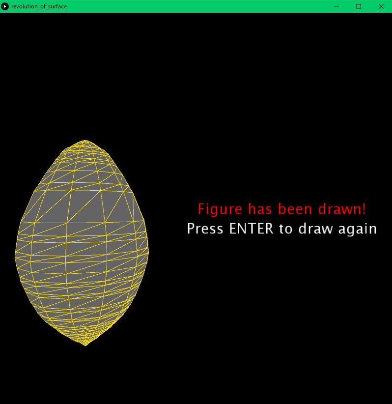
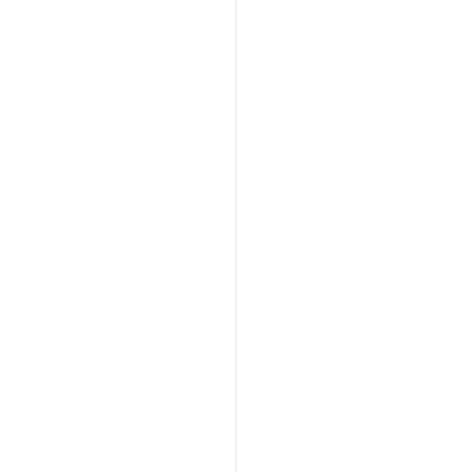

<!-- TABLE OF CONTENTS -->
<details open="open">
  <summary>Tabla de contenidos</summary>
  <ol>
    <li>
      <a href="#Autor">Autor</a>
    </li>
    <li>
      <a href="#Trabajo realizado">Trabajo realizado</a>
    </li>
    <li><a href="#decisiones-adoptadas">Decisiones adoptadas</a></li>
    <li><a href="#referencias">Referencias</a></li>
    <li><a href="#herramientas">Herramientas</a></li>
    <li><a href="#resultado">Resultado</a></li>
  </ol>
</details>


## Autor

El autor de este proyecto es el estudiante Alejandro Daniel Herrera Cárdenes para la asignatura Creando Interfaces de Usuario (CIU) para el profesor Modesto Fernando Castrillón Santana. 


## Trabajo realizado

El trabajo se basa en hacer una superficie de revolucion  en el programa Processing.

## Decisiones adoptadas

Las mayores decisiones tomadas y las que mas pruebas requirieron fue ajustar el algoritmo de superficie para que se generara la rotación y al final generara la figura.

* Método que crea la figura dibujada con el ratón.
  ```
  void create_revolution_of_surface(){
    if(drawing){
      stroke(255);
      line(400, 0, 400, 800);
      stroke (255, 225, 0);    
      if(mousePressed){
        if (mouseX<400){
          drawing=false;
          y0=mouseY;
          points.add(new Coordinates(0, y0));
        }else if (firstPress == 1) {
          firstPress = 0;
          x0=mouseX;
          y0=mouseY;
          point(x0, y0);
          points.add(new Coordinates(x0-400, y0));
        }
        else {   
          x=mouseX;
          y=mouseY;
          point(x, y);
          line(x0, y0, x, y);
          x0=x;
          y0=y;
          points.add(new Coordinates(x0-400, y0));
        }
      }
    } else if(!figureCreate){
      
        figureCreate=true;
        
        obj=createShape();
        obj.beginShape(TRIANGLE_STRIP);
        obj.fill(100);
        obj.stroke (255,225,0) ;
        
        Coordinates b, a=points.get(0);
        
        for(int i=1; i<points.size();i++){
          b=points.get(i);
          mainAlgorithm(a.x, a.y, b.x, b.y, 100);
          a = b;
        }  
        obj.endShape();
      
    } else {
      background(0);
      translate (mouseX, mouseY-100);
      shape(obj);
    }
  }
* Método principal del algoritmo de superficie de revolución que va rotando la figura para finalmente crearla.

  ```
  void mainAlgorithm(int x1, int y1, int x11, int y11, int diametro){
  
    int ax1 = x1;
    int ay1 = y1;
    int az1 = 0;
    int ax11 = x11;
    int ay11 = y11;
    int az11=0;
   
    double x2 ;
    double y2;
    double z2;
    
   for(int i=0;i<1201;i=i+diametro){
   
      int angulo=i;
      int z1=0;
    
      obj.vertex (ax1 , ay1 , az1 ) ;
  
      x2 = x1*Math.cos(angulo)-z1*Math.sin(angulo);
      y2 = y1;
      z2 = x1*Math.sin(angulo)+z1*Math.cos(angulo);
    
      obj.vertex ((int)x2 , (int)y2 , (int)z2 );
      ax1=(int)x2;
      ay1=(int)y2;
      az1=(int)z2;
    
      obj.vertex (ax11 , ay11 , az11 ) ;
    
      x2 = x11*Math.cos(angulo)-z1*Math.sin(angulo);
      y2 = y11;
      z2 = x11*Math.sin(angulo)+z1*Math.cos(angulo);
    
      obj.vertex ((int)x2 , (int)y2 , (int)z2 );
      ax11=(int)x2;
      ay11=(int)y2;
      az11=(int)z2;
    }
  }
  ```

 <p align="center"></br>Pantalla final</p>
 


## Referencias

Para ayudarme en la realización de esta aplicación usé básicamente la API que te proporciona [Processing](https://www.processing.org/).

## Herramientas

* [Processing](https://www.processing.org/)


## Resultado

Añado un GIF con el resultado de la aplicación moviendose ambas paletas y rebotando la pelota en ellas.

  * Resultado
  <p align="center"></br>Gif resultado final</p>
